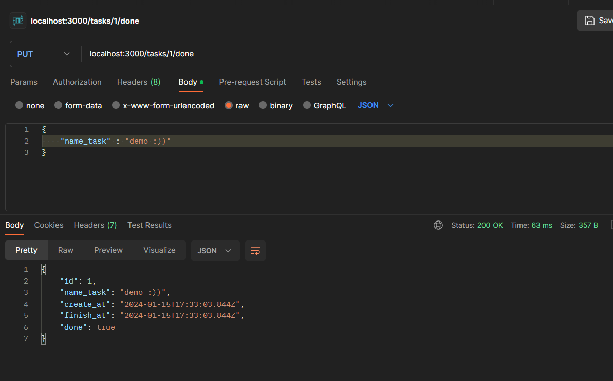

install with npm or yarn : `npm install or yarn install`
settings your Database PostgreSQL or any SQL

# task_BE_GDSC 

logger :

# create method for route /create

body : {
    "name_task" : "demo bla"
}

# update your task method PUT for route /:id you can use object only or same me
body : {
    "name_task" : "demo :))"
}

# update isDone to true method PUT for route /:id/done you can use object only or same me  :))
nobody

# delete method DELETE for route /:id/done you can use object only or same me  :))

# View my db

